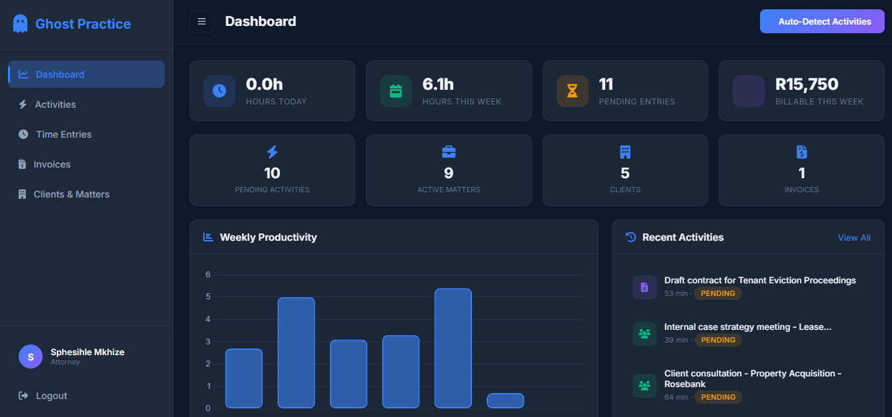
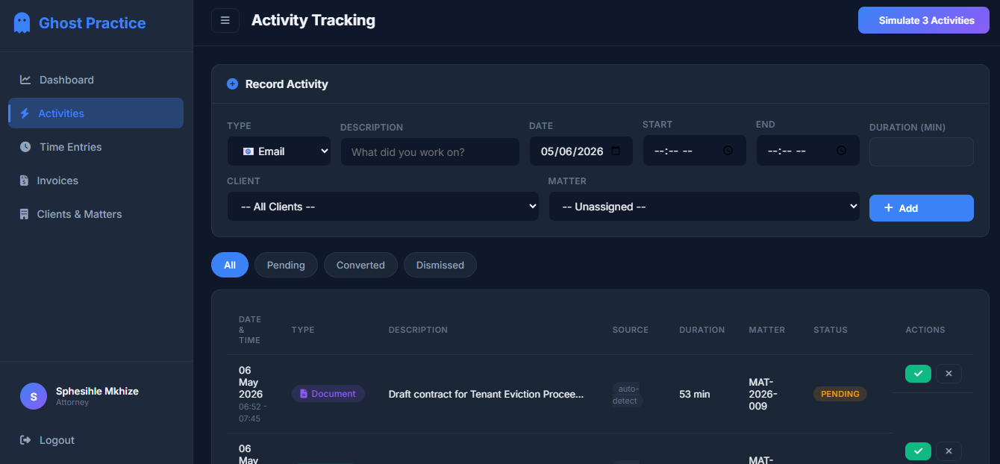
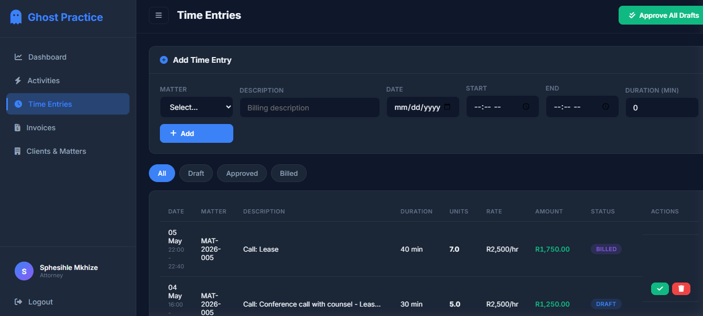
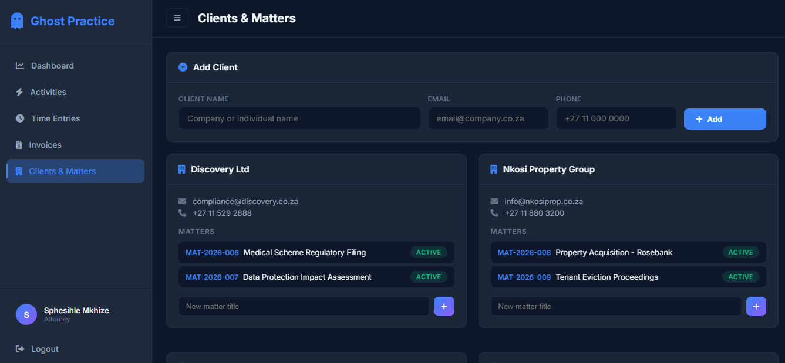
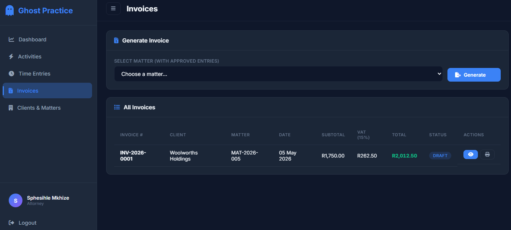

# Ghost Practice - Automated Time Tracking & Billing Demo

Welcome to the MB Software Engineer Assessment prototype. This project demonstrates an automated time tracking and billing solution designed specifically for legal practices, addressing the inefficiencies of manual time reconstruction.

## 🚀 How to Run the Application

### 1. Prerequisites
Ensure you have **Python 3** installed on your system.

### 2. Install Dependencies
Open your terminal or command prompt in the project folder and run:
```bash
pip install -r requirements.txt
```

### 3. Seed the Database
To populate the database with realistic demo data (users, clients, matters, and past activities), run the following command:
```bash
python seed_data.py
```
*Note: You only need to run this once, or whenever you want to completely reset the database back to its initial state.*

### 4. Start the Server
Run the Flask application:
```bash
python app.py
```
Once the server is running, open your web browser and navigate to: **http://127.0.0.1:5000**

### 5. Demo Credentials
You can log in using the following pre-configured accounts:
- **Attorney Account:** `sphesihle@mb.co.za` (Password: `password123`)
- **Manager Account:** `thabo@mb.co.za` (Password: `password123`)

---

## 📸 Screenshots

### 1. Dashboard


### 2. Activities (Auto-Tracking Simulation)


### 3. Time Entries (Billing Units)


### 4. Clients & Matters


### 5. Invoice Generation


---

## 📄 Project Documentation

### 1. Introduction
Legal professionals rely on time-based billing to charge clients for services rendered. However, manual time tracking often leads to inefficiencies, missed billable hours, and inaccurate invoicing. Attorneys typically reconstruct their day, which reduces productivity and introduces errors.
This document presents a smart, automated time tracking system designed to capture user activities in real time, associate them with client matters, and generate accurate billing outputs with minimal manual effort.

### 2. Problem Statement
The current approach to time tracking presents several challenges:
- Manual reconstruction of work activities
- Loss of billable hours
- Inaccurate time estimation
- Reduced productivity
- Inefficient billing processes

### 3. Objectives
The proposed system aims to:
- Automate time tracking
- Improve billing accuracy
- Reduce manual input
- Integrate with existing tools (email, calendar, document systems)
- Provide clear and structured billing outputs

### 4. System Overview
The system is designed as a semi-automated solution that captures user activities such as emails, meetings, and document editing in the background. These activities are processed and converted into structured time entries linked to specific client matters.
Users are given the ability to review and approve entries before they are used for billing, ensuring both automation and control.

### 5. Key Features
- **Automatic activity tracking** (simulated for demo purposes)
- **Smart conversion of activities into time entries** (6-minute billing increments)
- **Client and matter assignment** with cascading filtering
- **Editable and reviewable time entries** with workflow status (draft, approved, billed)
- **Invoice generation** with automatic 15% VAT calculation
- **Dashboard** for monitoring productivity and billing (with interactive charts)

### 6. System Architecture

**Description:**
The system follows a modular client-server architecture consisting of multiple interacting components:
- **Frontend (Web Application):** Provides user interface for viewing time entries, dashboards, and invoices. Built using HTML5, CSS3 (custom design system), and JavaScript (Chart.js).
- **Activity Tracker Service:** Captures user activity from integrated systems. (Note: For the prototype, this is simulated using an auto-detect algorithm to demonstrate the workflow).
- **Backend Server (API):** Processes activities, applies business logic, and manages billing operations. Built using Python and the Flask framework.
- **Database:** Stores all system data including users, activities, time entries, and invoices. Uses SQLite for the prototype via SQLAlchemy ORM.
- **External Systems:** Includes email platforms, calendar tools, and document editors (simulated in demo).
- **Billing Output:** Generates print-ready invoices and reports.

**Explanation:**
User activities are captured automatically through the Activity Tracker, which integrates with external systems. These activities are sent to the backend, where they are processed into structured time entries. The backend communicates with the database to store and retrieve data, and applies billing logic to generate invoices. The frontend allows users to interact with the system and review outputs.

### 7. Entity Relationship Diagram (ERD)

**Entities:**
- `User`: Represents attorneys using the system
- `Client`: Represents customers receiving services
- `Matter`: Represents a case linked to a client
- `Activity`: Represents tracked user actions (email, meeting, document)
- `TimeEntry`: Represents billable records derived from activities
- `Invoice` & `InvoiceItem`: Represents billing documents and individual billed entries

**Key Relationships:**
- A User performs one or many Activities
- A Client has one or many Matters
- A Matter has one or many TimeEntries
- An Activity may generate a TimeEntry
- A Matter has one or many Invoices
- An Invoice contains one or many InvoiceItems
- A TimeEntry may be linked to one InvoiceItem

### 8. System Workflow
1. User performs an activity (email, meeting, document editing)
2. Activity Tracker captures the activity automatically
3. Activity is sent to the Backend Server
4. Backend processes the activity into a TimeEntry
5. TimeEntry is linked to a Matter and Client
6. User reviews and updates the TimeEntry (status changes)
7. Approved TimeEntries are converted into InvoiceItems
8. InvoiceItems are grouped into an Invoice
9. Invoice is generated and presented to the user as a PDF

### 9. User Stories
1. **Automatic Activity Tracking:** As an attorney (user), I want my activities to be tracked automatically so that I don’t forget to log billable time.
2. **Convert Activities into Billable Time:** As an attorney, I want my tracked activities to be converted into time entries so that I can accurately record my work.
3. **Assign Work to Client Matters:** As an attorney, I want my work to be linked to specific client matters so that billing is accurate.
4. **Review and Edit Time Entries:** As an attorney, I want to review and edit my time entries before invoicing so that I can ensure correctness.
5. **Generate Invoices Automatically:** As a firm manager, I want invoices to be generated from approved time entries so that billing is efficient.
6. **View Billing and Reports:** As a user, I want to view invoices and reports so that I can monitor billing and productivity.

### 10. Alignment of System Components
The system design ensures alignment between user needs, system architecture, and data structure. Each user story is supported by specific components and entities within the system. This alignment ensures that the system is both functional and scalable while directly addressing user requirements.

### 11. Prototype Implementation Note
For the purposes of the assessment demonstration, a functional prototype has been developed. Key aspects of the prototype include:
- **Tech Stack:** Python (Flask), SQLite, HTML/CSS/JS.
- **Role-Based Access:** Simulates users with different roles (e.g., Attorney vs. Manager) and varying hourly rates.
- **Activity Simulation:** Features an "Auto-Detect" mechanism that generates realistic, simulated activities to demonstrate the automated capture process without requiring local machine installations.
- **Billing Logic:** Implements standard legal billing practices, including automatic rounding to 6-minute increments and 15% VAT calculation.

### 12. Conclusion
The proposed system provides a practical and efficient solution to the challenges of manual time tracking in legal practices. By automating activity capture and integrating it with billing processes, the system improves accuracy, reduces administrative workload, and enhances productivity. The design balances automation with user control, ensuring both usability and reliability.
